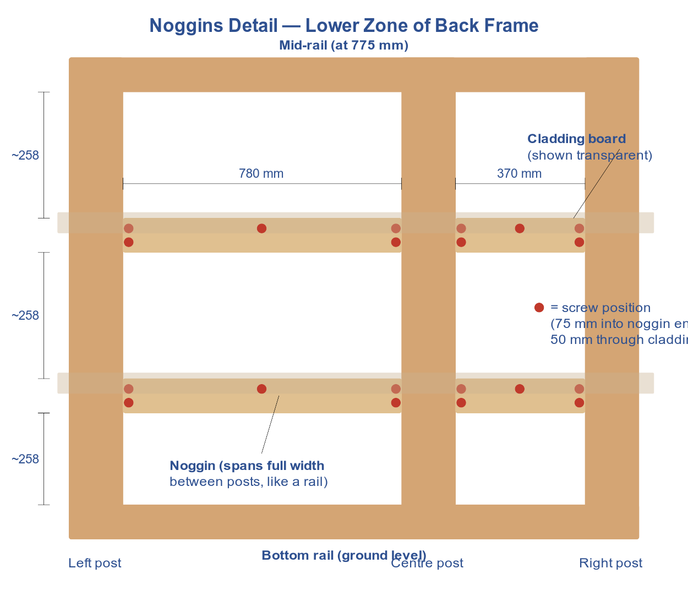

> **Noggins are OPTIONAL for this build.** The mid-rail, top rail, and bottom rail provide sufficient fixing points. Add noggins in Weekend 3 only if the cladding boards bow or feel loose.

# What Are Noggins?

Noggins are horizontal members of 50 x 47 mm timber that span the full distance between two posts, like short rails or ladder rungs. They provide intermediate fixing points for cladding boards in the lower zone of the frame.

## Why They're Needed

The featheredge cladding boards run horizontally across the frame. They screw into the posts at each edge, but the gap between posts is too wide for the boards to span unsupported -- without noggins the boards would bow outward or flap in the wind. Noggins fill that gap by providing extra fixing points between the posts, just like rails do in the upper zone.

## Where They Go

Noggins sit in the **lower zone** of each clad wall -- the area between the mid-rail (at 775 mm) and the bottom rail (at ground level). Two noggins per wall section, spaced at roughly 258 mm and 517 mm up from the bottom rail. The upper zone uses X-braces instead, so no noggins are needed there.

The three clad wall sections that need noggins are:

| Wall Section | Between Posts | Noggin Length | Qty |
|---|---|---|---|
| Back wall -- left section | Left-back post to centre-back post | 780 mm | 2 |
| Back wall -- right section | Centre-back post to right-back post | 370 mm | 2 |
| Left side wall | Left-front post to left-back post | 750 mm | 2 |

Noggin lengths match the clear span between the inside faces of the posts in each section -- the same distance that rails span.

## How to Install Them

1. Cut 50 x 47 mm timber to the lengths listed above (measure the gap between your posts and cut to fit snugly).
2. Hold each noggin horizontally between the two posts, 50 mm face out (flat face for cladding to screw into).
3. Fix each end with 2x 75 mm screws -- either screw through the post into the noggin's end grain, or toe-screw at 45 degrees through the noggin into the post. Pre-drill to avoid splitting.

## How Many

You need **6 noggins** total (2 per clad wall section). The two 370 mm noggins (back right section) can be cut from offcuts. The longer noggins require dedicated stock: one 1.8 m stick yields 2x 780 mm noggins and another yields 2x 750 mm noggins. This uses 2 of the 4 spare 50 x 47 mm 1.8 m sticks.
