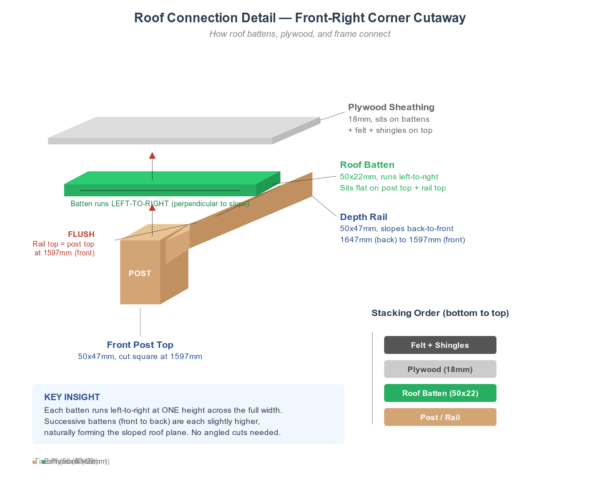

# Roof Connection Guide -- How the Roof Meets the Frame

The sloped roof sits on top of the bin store frame without any angled cuts -- battens running left-to-right across the sloped depth rails create the roof plane automatically.

## The Key Insight

The depth rails slope from 1647mm (back) down to 1597mm (front), with their top edges flush with the post tops at each end. Roof battens (50x22mm) run **perpendicular to the slope** -- left-to-right across the full width. Because each batten sits at a single height across the structure, successive battens from front to back are each slightly higher than the one before. This naturally forms the sloped roof surface.

- A batten at the **front** sits on all front post tops and the front ends of the depth rails -- all at 1597mm.
- A batten at the **back** sits on all back post tops and the back ends of the depth rails -- all at 1647mm.
- A batten in the **middle** sits on the depth rails at their midpoint -- roughly 1622mm.

## Why No Angled Cuts Are Needed

The posts are cut flat (square). The depth rails are cut square too -- the ~3.8-degree slope is slight enough that square-cut rail ends seat cleanly against the posts. The battens sit flat across the tops. Every piece is a simple square cut.

## Stacking Order (bottom to top)

1. **Post tops / depth rail tops** -- the frame (50x47mm timber)
2. **Roof battens** -- 50x22mm, running left-to-right, screwed down into the rails and posts
3. **Plywood sheathing** -- 18mm, nailed or screwed to the battens
4. **Roofing felt** -- rolled over the plywood, tacked down
5. **Shingles** -- nailed through felt into plywood

Each layer simply sits flat on the one below it. The slope is built into the frame -- everything above just follows it.
